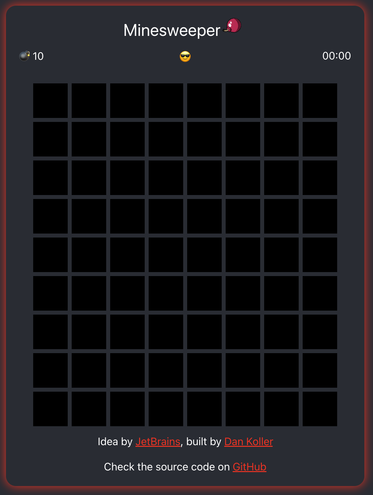

# React Minesweeper

This is a demo application originated from a learning track of <a href="https://www.jetbrains.com/academy/">
JetBrains</a>. I built this application in order to learn more about React and component based architecture. There is
also a live demo available hosted on Heroku. Just check the link of this repository.



## Get started

- Clone this repository:

```sh
git clone github.com/dan-koller/React-Minesweeper
```

- Navigate to the directory:

```sh
cd React-Minesweeper
```

- Install the dependencies:

```sh
npm install
```

- Run the app locally:

```sh
npm start
```

The app and demo are using the development build of React. Note that this build is not suitable for production. Make sure to [use the production build](https://reactjs.org/docs/optimizing-performance.html#use-the-production-build) before deployment.

## How to play

This game follows the basic principe of the original Minesweeper from Windows (except that you can land on a mine
first try). You can clear, find and flag mines. To reset the field, just click onto the Emoji in the mid.
Have fun playing!

## Stack
- Node
- React
- JavaScript
- CSS
